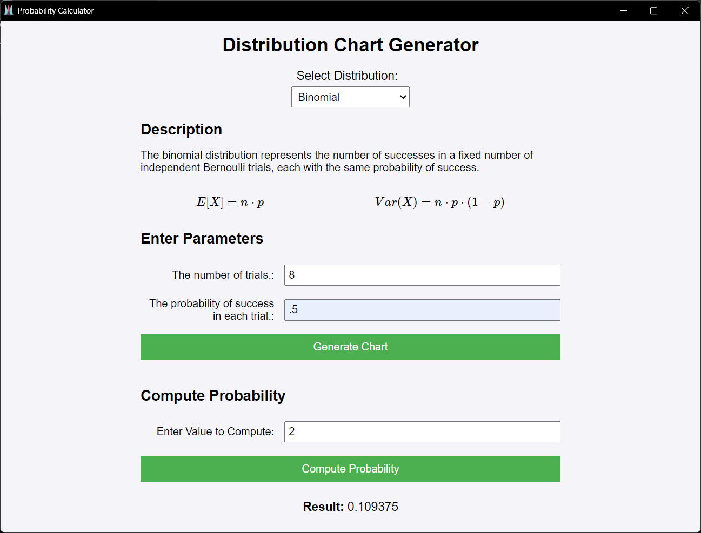
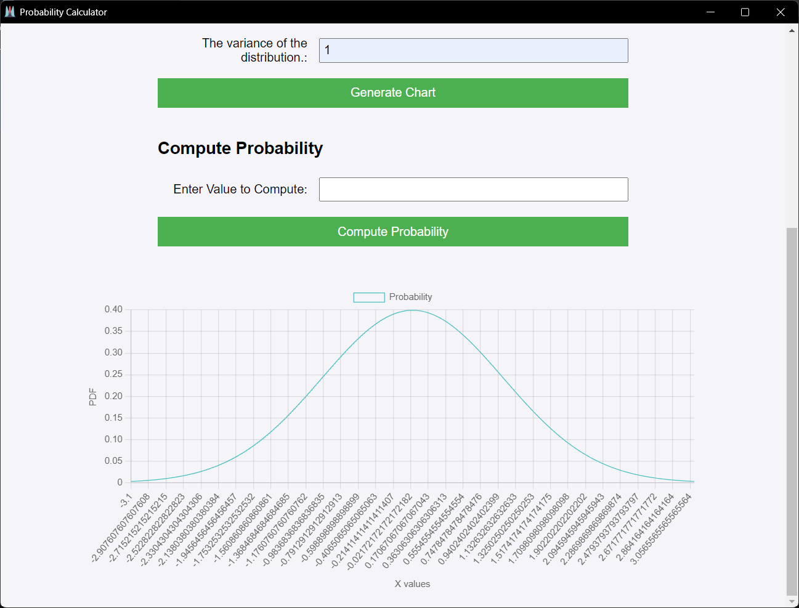

# Day 1-2: Distribution Chart Generator with Python Eel and Web Tools

## Project Overview

For the day 1 and 2 of my bootcamp, I worked on a simple application using **Python Eel** combined with HTML, CSS, and JavaScript to create an interactive interface that generates distribution charts. The interface allows users to:
- Select a probability distribution (e.g., Binomial, Poisson, Normal).
- Input relevant parameters for the selected distribution.
- Display charts based on the inputs (either continuous or histogram, depending on the distribution type).
- View essential properties such as the **mean** and **variance** for each distribution.

### Features:
- **Dynamic Form Generation**: The form adapts to different distributions, automatically generating inputs for parameters like the mean, variance, or other relevant variables.
- **Real-Time Chart Generation**: The app processes inputs and visualizes the probability distributions using charts (via Chart.js), offering immediate feedback to the user.
- **Basic Distribution Descriptions**: Displays a brief description and properties (mean, variance) for each distribution.
- **Interactive Probability Computation**: Users can input values to compute specific probabilities for a given distribution.

### Screenshots:

## Concepts Covered on Days 1-2:
While random variables and distributions can be understood with some basic knowledge, I decided to dive deeper into the subject. I spent more time than originally planned (2 days) and revisited concepts from **A First Course in Probability Theory by Sheldon Ross** to refresh and expand my understanding of the following:
- Discrete and continuous random variables.
- Essential probability distributions, their properties, and applications.
- A deeper understanding of probability theory, beyond the bootcamp's initial scope.

This extra time was spent purely for fun and personal enrichment, as understanding these topics at a foundational level has been crucial for further work on this app and future projects.

### Notes on Distributions:
For more information about the distributions implemented in this project, I've taken some notes to better understand their:
- **Key parameters** (e.g., \(n\), \(p\) for binomial distributions).
- **Properties** like the mean, variance, skewness, and moments.
- **Applications** in real-world scenarios.

[https://drive.google.com/file/d/1TlSi2p8wNxGrSIwz3Kk4IrzxcrtSO3ky/view?usp=drive_link](https://drive.google.com/file/d/1sFOvhg6CwKeywNlrHeJJEEk7qpJ_KA3G/view?usp=sharing)
