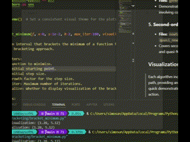

# 100 Days of ML Bootcamp - Days 5 to 10

Welcome to the ML bootcamp project repository! This section, spanning days 5 to 10, focuses on implementing various optimization techniques as outlined in _Algorithms for Optimization_ by Kochenderfer and Wheeler. The directory is organized by specific optimization methods, and each method has been implemented with real-time 2D visualization to enhance the understanding of convergence paths.

## Directory Structure

```plaintext
├── calculus.ipynb
├── custom-linear-algebra.ipynb
├── la-numpy.ipynb
└── optimization/
    ├── bracketing/
    │   ├── bisection.py
    │   ├── bracket_minimum.py
    │   ├── fibonacci_search.py
    │   ├── golden_section_search.py
    │   ├── quadratic_fit_search.py
    │   └── shubert_piyavskii.py
    ├── constrained_optimization/
    │   ├── cvxopt_test.ipynb
    │   └── simplex_implement_test.ipynb
    ├── local_descent/
    │   ├── adadelta.py
    │   ├── adagrad.py
    │   ├── adam.py
    │   ├── backtracking_line_search.py
    │   ├── conjugate_gradient_descent.py
    │   ├── gradient_descent.py
    │   ├── gradient_descent_momentum.py
    │   ├── gradient_descent_nestrov.py
    │   ├── hyper_gradient_descent.py
    │   ├── hyper_nestrov.py
    │   ├── line_search.py
    │   ├── rms_prop.py
    │   └── strong_backtracking.py
    ├── population/
    │   └── genetic_algorithm.py
    └── second_order_methods/
        ├── newtons_method.py
        ├── quasi_newton_bfgs.py
        ├── quasi_newton_dfp.py
        ├── secant_method.py
        ├── secant_method2.py
        └── utils.py
```

## Project Overview

This segment of the bootcamp explores and implements a wide range of optimization techniques, organized as follows:

### 1. **Bracketing Methods**
   - **Files:** `bisection.py`, `bracket_minimum.py`, `fibonacci_search.py`, `golden_section_search.py`, `quadratic_fit_search.py`, `shubert_piyavskii.py`
   - These files implement bracketing algorithms that iteratively narrow down intervals to locate minima.

### 2. **Constrained Optimization**
   - **Files:** `cvxopt_test.ipynb`, `simplex_implement_test.ipynb`
   - Implements constrained optimization techniques, including linear programming with Simplex.

### 3. **Local Descent Methods**
   - **Files:** `adadelta.py`, `adagrad.py`, `adam.py`, `conjugate_gradient_descent.py`, and more
   - Explores gradient-based optimization algorithms, with a focus on various line search techniques for tuning step sizes.

### 4. **Population-based Methods**
   - **Files:** `genetic_algorithm.py`
   - Demonstrates genetic algorithm approaches, useful for optimizations involving complex landscapes.

### 5. **Second-order Methods**
   - **Files:** `newtons_method.py`, `quasi_newton_bfgs.py`, `quasi_newton_dfp.py`, `secant_method.py`
   - Covers second-order optimization methods, including Newton’s method and quasi-Newton approaches like BFGS and DFP.

## Visualizations

Each algorithm includes real-time 2D visualizations that trace the optimization path, providing an intuitive view of the algorithm's performance over time. For a quick demonstration, an example GIF is included to show these visualizations in action.




## Notes

- All implementations are based on algorithms presented in _Algorithms for Optimization_ by Mykel J. Kochenderfer and Tim A. Wheeler (2019).

---

Feel free to explore the various techniques, and follow along as I document each day’s progress in the bootcamp!